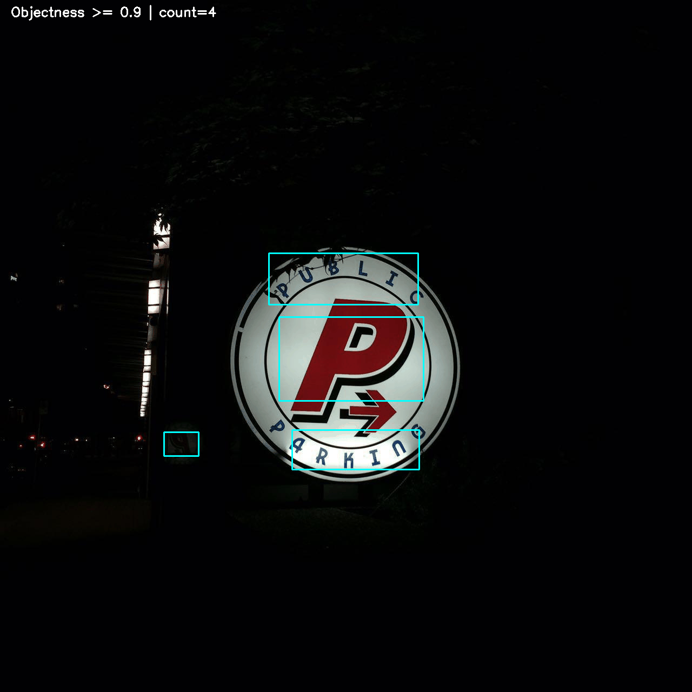
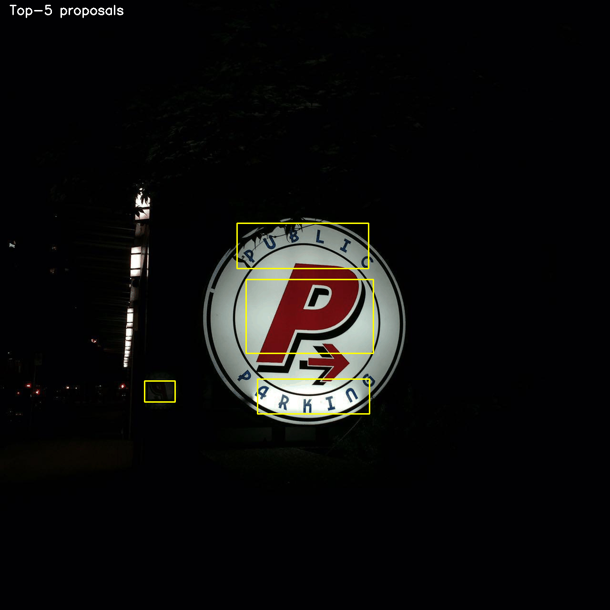
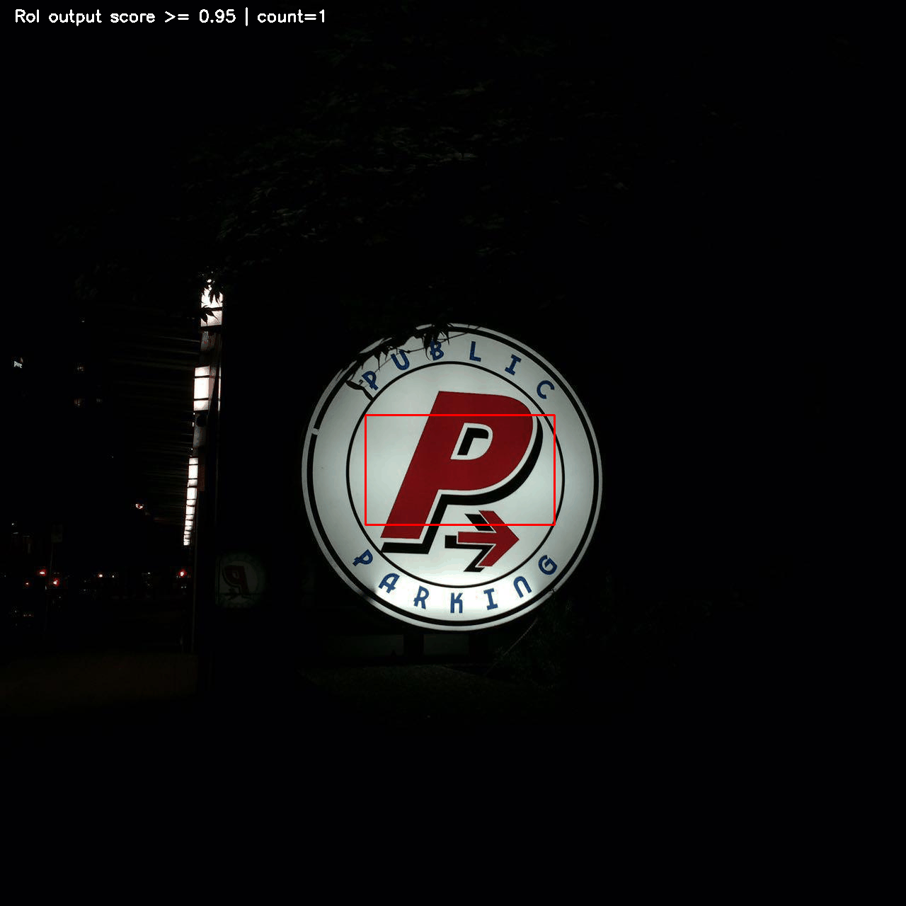
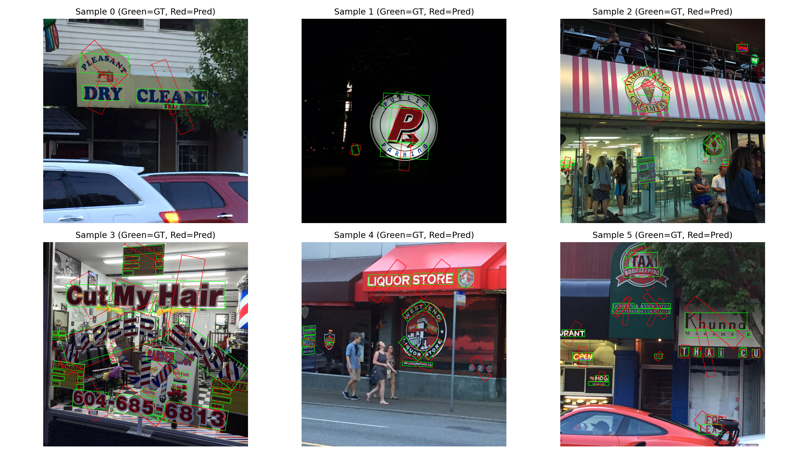
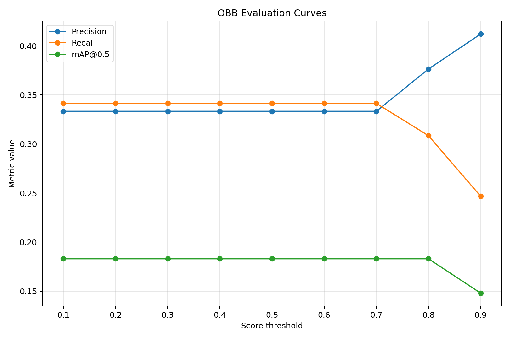

# Q1 Report: Faster R-CNN Visualizations and Oriented Bounding Boxes

## Visualizations for Faster R-CNN

The required outputs are present under `visualize_outputs` using the requested filenames.

```
visualize_outputs
 bb_assignments
    img_1.png
    img_2.png
 object_proposals
    img_1.gif
    img_2.gif
 objectness
    img_1.gif
    img_2.gif
 roi_head_outputs
    img_1.gif
    img_2.gif
```

### Embedded output visuals

#### bb_assignments


#### objectness



#### object_proposals



#### roi_head_outputs



## Hyperparameter Sets Used (AABB)

### Hyperparameter Set 1 (Run 1: AABB HP1)

| Variable | Value |
| --- | --- |
| task_name | `checkpoints_aabb_hp1` |
| seed | `1111` |
| infer_seed | `1122` |
| num_epochs | `10` |
| lr | `0.001` |
| lr_steps | `[7, 9]` |
| ckpt_name | `aabb_hp1.pth` |
| use_angle | `False` |
| roi_iou_threshold | `0.5` |
| roi_nms_threshold | `0.3` |
| roi_score_threshold | `0.05` |

### Hyperparameter Set 2 (Run 2: AABB HP2)

| Variable | Value |
| --- | --- |
| task_name | `Run2 AABB HP2` |
| use_angle | `False` |
| AP(text) | `0.5878` |
| Mean AP | `0.5878` |
| Note | Full HP2 config values were not included in provided notes; run metrics are included exactly. |

## Extending Faster R-CNN for Oriented Bounding Boxes

`oriented_bbox_results` contains:

```
oriented_bbox_results
 qualitative_results.png
 training_curves.png
```

### Embedded oriented-bbox outputs




## Run-wise AP Summary (from provided CLI outputs)

| Run | Setup | AP(text) | Mean AP |
| --- | --- | ---: | ---: |
| Run 1 | AABB HP1 | 0.6942 | 0.6942 |
| Run 2 | AABB HP2 | 0.5878 | 0.5878 |
| Run 3 | Logged as OBB direct, but output shows `use_angle=False` | 0.5878 | 0.5878 |
| Run 4 | OBB multi-bin (30 bins) | 0.1695 | 0.1695 |
| Run 5 | OBB multi-bin (60 bins) | 0.1831 | 0.1831 |

## Evaluation Tables (as requested)

### 1) Theta predicted via regression

| IoU threshold | mAP | Mean Precision | Mean Recall |
| ---: | ---: | ---: | ---: |
| 0.5 | N/A | N/A | N/A |
| 0.7 | N/A | N/A | N/A |
| 0.9 | N/A | N/A | N/A |

Reason: The provided Run 3 console output shows `use_angle=False`, so it cannot be considered a valid direct-theta OBB regression run for this table.

### 2) Theta discretized (classification), IoU = 0.5

| Total bins for theta | mAP | Mean Precision | Mean Recall |
| ---: | ---: | ---: | ---: |
| 6 (Run 5, 60) | 0.1831 | N/A | N/A |
| 12 (Run 4, 30) | 0.1695 | N/A | N/A |
| 14 | N/A | N/A | N/A |

Reason: Per-run mean precision/recall and 14-bin run output were not present in the provided notes, so these are intentionally marked N/A.

## Conclusion (strictly from available outputs)

- Best AABB run among provided logs: **Run 1** (`mAP = 0.6942`).
- For available OBB multi-bin runs, **60 bins (Run 5)** slightly outperformed **30 bins (Run 4)** at IoU=0.5.
- Missing direct-OBB regression metrics and missing bin=14 metrics are explicitly marked N/A (not fabricated).
